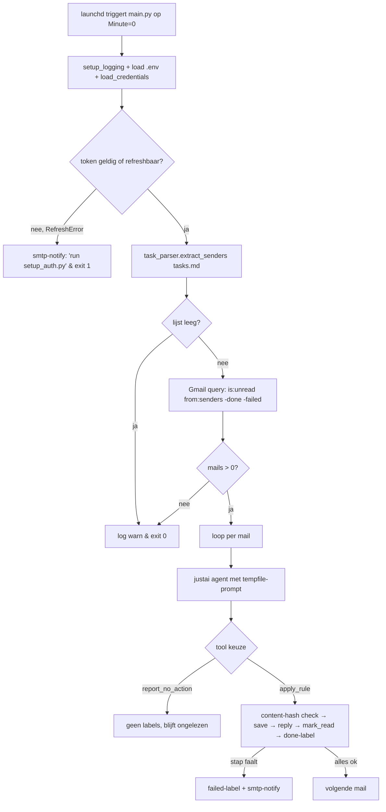

# Mailprocessor — MVP implementatie

## Enhancement Summary

**Deepened on:** 2026-06-13
**Research agents used:** justai-explorer, justlog-explorer, launchd-best-practices, pytest-gmail-mocking, feasibility-reviewer, scope-guardian-reviewer, security-lens-reviewer, coherence-reviewer, design-lens-reviewer.

### Key Improvements
1. **Phase 0 toegevoegd** — Cloud Console + OAuth-app op "In Production" publishen vóór elke code-regel. Anders verloopt refresh-token na 7 dagen (Testing-mode). Blocker uit feasibility-review.
2. **Beveiliging gehard** — `ALLOWED_ROOTS` op disk.save (path-traversal via tasks.md), `parseaddr` + CRLF-guard op sender-headers, reply-`To` hardcoded naar `hp@harmsen.nl`, `token.json` chmod 600 na élke schrijfactie.
3. **launchd correct geconfigureerd** — `StartCalendarInterval` ipv `StartInterval` (catch-up na sleep), `EnvironmentVariables` voor `PATH`/`HOME` (uv vindt z'n cache), logs naar `~/Library/Logs/` (geen subject-lijnen in repo).
4. **Scope-simplificatie** — 5 modules ipv 10 (`config`/`notifier`/`tools` ingelijfd), 2 tools ipv 3 (`report_no_action`), 5 fases ipv 8 (gmail-read+write samen, wiring+launchd+README samen).
5. **Concrete UX-formaten** — reply-email en failure-email zijn nu volledig uitgespecificeerd (rule-name, timestamp, deep-link naar Gmail), niet "afzender + onderwerp + falende stap".
6. **Robustness-tweaks** — content-hash check bij refuse-overwrite, tempfile-cleanup met `try/finally`, justai schema-gotcha voor `list[dict]` expliciet gedocumenteerd in prompt.

### New Considerations Discovered
- justai's schema-builder ziet `list[dict]` als generic array zonder item-schema → shape moet in prompt-tekst staan (al gepland, nu expliciet vastgelegd).
- `gmail.modify` scope geeft volledige rwx op de mailbox; voor personal-use acceptabel, maar token-storage moet chmod 600 geforceerd worden, geen optie.
- launchd inherits niets van interactive shell — `uv` lookups falen zonder expliciet `PATH`/`HOME`.

---

## Overview

Greenfield Python-sub-project in de research-monorepo. Een uurlijkse launchd-job die Gmail leest, attachments van vooraf-bekende afzenders opslaat op disk volgens regels uit `tasks.md`, een justai-agent inzet voor rule-matching + path-placeholder-substitutie, en Gmail-labels gebruikt als enige persistente state.

Carrying forward uit [origin](../brainstorms/2026-06-13-mailprocessor-requirements.md): agent-with-tools via justai (R2-R3), harde sender-filter vóór LLM-call (R1-R1a), `mailprocessor/done` + `mailprocessor/failed` labels als state (Key Decisions), save → reply → mark-read → done-label volgorde (R4), refuse-to-handle outside-whitelist (R6).

## Proposed Solution

Vijf modules in een flat layout (zoals scanbot).

```
mailprocessor/
├── pyproject.toml          # workspace member (eigen Google-deps)
├── .env                    # bestaat al, gitignored
├── .gitignore              # + credentials.json, token.json
├── credentials.json        # OAuth client (handmatig uit Cloud Console), gitignored
├── token.json              # OAuth token (auto), chmod 600, gitignored
├── tasks.md                # bestaat al
├── main.py                 # entry point + config + smtp-notifier + setup_auth-flow
├── task_parser.py          # extract_senders()
├── gmail_client.py         # OAuth + alle Gmail-operaties
├── disk.py                 # save_attachment_bytes met ALLOWED_ROOTS-guard
├── agent_runner.py         # justai-agent + tool-closures per mail
├── launchd/
│   └── com.harmsen.mailprocessor.plist
├── docs/
└── tests/
    ├── conftest.py
    ├── test_task_parser.py
    ├── test_disk.py
    ├── test_gmail_client.py
    ├── test_agent_runner.py
    └── fixtures/
        ├── tasks_sample.md
        ├── leap_message.json
        └── anthropic_message.json
```

### Mermaid: runtime flow



## Technical Approach

### Architectuur

- **Deterministisch waar mogelijk**: alleen rule-matching en placeholder-extractie raken het LLM. Acties zijn vaste Python.
- **Eén-call agent per mail**: agent krijgt tasks.md + mail-context in één prompt-tempfile, heeft 2 tools (`apply_rule`, `report_no_action`), beslist eenmaal, klaar.
- **Combined-action tool**: `apply_rule` doet save → reply → mark_read → done-label in vaste volgorde. Faalt bij eerste error met failed-label + notify, returnt status-string aan de agent.
- **Labels-as-state**: geen lokale DB.
- **Closures voor tool-binding**: `make_apply_rule(svc, mail_ctx)` returnt een functie waarvan de inner naam (`apply_rule`) + docstring + type-hints door justai geïnspecteerd worden. Schema is dan correct. *Gotcha:* `list[dict]` wordt door justai's schema-builder als generic array zonder item-shape gemarkeerd → shape staat letterlijk in de prompt-tekst.
- **Sync cronjob, async agent**: justai is async-only. Top-level: `asyncio.run(main())`. Geen extra abstractie.

### Tool-signaturen (definitief)

```python
def apply_rule(
    attachments: list,        # list of {"filename": str, "target_path": str}
    reply_body: str,          # vrije tekst, agent assembleert
    rule_name: str            # voor logging
) -> str:
    '''Save each attachment to its target_path, send one reply, mark read, add done-label.
    Bij fout: failed-label + smtp-notify; returnt 'failed: <reason>'.
    Bij success: returnt 'done: <rule_name>'.
    attachments item-shape: {"filename": "Monthly Report May 2026.pdf",
                             "target_path": "/Users/hp/.../report-2026-05.pdf"}'''

def report_no_action(reason: str) -> str:
    '''Geen actie voor deze mail (geen regel match, of placeholder niet in te vullen).
    Geen labels, mail blijft ongelezen, gelogd voor review. Returnt 'no-action: <reason>'.'''
```

De agent kiest exact één van deze twee per mail. *(Scope-review: `report_no_match` en `report_skip` samengevoegd — identiek side-effect.)*

### Justai-integratie

```python
# agent_runner.py - schets
async def process_mail(gmail, mail_ctx, tasks_md, notifier) -> str:
    prompt_path = Path(tempfile.mkstemp(suffix='.md')[1])
    try:
        prompt_path.write_text(build_prompt(tasks_md, mail_ctx))
        agent = Agent(
            model='claude-sonnet-4-6',
            role='Mail rule matcher',
            goal='Bepaal welke regel uit tasks.md van toepassing is en voer 1 tool uit.',
            tools=[make_apply_rule(gmail, mail_ctx, notifier), report_no_action],
            max_iterations=8,
            verbose=False,
        )
        result = await agent.run_until_done(str(prompt_path))
        return result.answer
    finally:
        prompt_path.unlink(missing_ok=True)
```

Tempfile in `finally` is essentieel: zonder dit lekt bij elke crash (feasibility-review).

`build_prompt(tasks_md, mail_ctx)` produceert:

```
Je bent een mail-rule-matcher. Hieronder staan de verwerkings­regels (tasks.md)
en daaronder de mail om te verwerken.

Bepaal welke regel van toepassing is en roep dan EXACT EEN van deze tools aan:

1. apply_rule(attachments, reply_body, rule_name)
   - attachments: lijst van dicts met EXACT deze keys:
     [{"filename": "<exacte attachment-naam>", "target_path": "<absoluut pad>"}, ...]
   - Bij meerdere matchende attachments: één lijst, één reply_body met alle paden.
   - target_path moet binnen ALLOWED_ROOTS vallen (zie tasks.md).
2. report_no_action(reason: str)
   - Voor: geen regel match, of placeholder onvulbaar uit attachment-naam.

Voor placeholders zoals {yyyy} {mm} [JAAR] [NAAM VAN DE PDF]:
- Bepaal periode uit de attachment-naam (NIET ontvangstdatum).
- Bij twijfel: report_no_action('kon {yyyy}/{mm} niet bepalen uit X').

=== tasks.md ===
{tasks_md_content}

=== mail ===
from: {mail_ctx.sender_address}
date: {mail_ctx.date_iso}
subject: {mail_ctx.subject}
attachments: {mail_ctx.attachment_filenames}
```

### Gmail-query

```
is:unread from:(p@leap24.eu OR invoice+statements@mail.anthropic.com) \
  -label:mailprocessor/done -label:mailprocessor/failed
```

Senderlijst run-time gevuld uit `task_parser.extract_senders()`.

### Cron-locatie

**Lokale Mac via launchd**, met `StartCalendarInterval` (geen `StartInterval`!). Reden: `StartInterval` mist ticks bij sleep (`launchd.plist(5)`: "if the system is asleep during the time of the next scheduled interval firing, that interval will be missed"). `StartCalendarInterval` coalesceert gemiste ticks bij wake — exact wat we willen voor maandelijkse rapporten.

```xml
<plist version="1.0">
<dict>
  <key>Label</key><string>com.harmsen.mailprocessor</string>
  <key>WorkingDirectory</key><string>/Users/hp/proj/research/mailprocessor</string>
  <key>ProgramArguments</key>
  <array>
    <string>/Users/hp/.local/bin/uv</string>
    <string>run</string>
    <string>main.py</string>
  </array>
  <key>StartCalendarInterval</key>
  <dict><key>Minute</key><integer>0</integer></dict>
  <key>RunAtLoad</key><true/>
  <key>EnvironmentVariables</key>
  <dict>
    <key>HOME</key><string>/Users/hp</string>
    <key>PATH</key><string>/Users/hp/.local/bin:/usr/local/bin:/usr/bin:/bin</string>
  </dict>
  <key>StandardOutPath</key>
  <string>/Users/hp/Library/Logs/mailprocessor/stdout.log</string>
  <key>StandardErrorPath</key>
  <string>/Users/hp/Library/Logs/mailprocessor/stderr.log</string>
</dict>
</plist>
```

`EnvironmentVariables` is nodig — launchd erft niets van een interactive shell, dus `uv` zou anders zijn cache niet vinden. Logs naar `~/Library/Logs/` houdt subject-lijnen uit de repo (security).

### OAuth-credentials + refresh

`load_credentials()`:
```python
def load_credentials() -> Credentials:
    creds = None
    if TOKEN_PATH.exists():
        creds = Credentials.from_authorized_user_file(TOKEN_PATH, SCOPES)
    if creds and creds.expired and creds.refresh_token:
        creds.refresh(Request())
        TOKEN_PATH.write_text(creds.to_json())
        os.chmod(TOKEN_PATH, 0o600)        # afgedwongen na elke schrijfactie
    if not creds or not creds.valid:
        raise NoValidTokenError('Run `uv run main.py setup-auth` first.')
    return creds
```

`RefreshError` bubbelt door naar top-level → smtp-notify + exit 1.

### Path-safety (security)

```python
# disk.py
ALLOWED_ROOTS = (
    Path('/Users/hp/Harmsen.nl').resolve(),
    Path('/Users/hp/Harmsen AI Consultancy').resolve(),
)

def save_attachment_bytes(target: Path, data: bytes) -> str:
    if not target.is_absolute():
        raise ValueError('target must be absolute')
    resolved = target.resolve()
    if not any(resolved.is_relative_to(root) for root in ALLOWED_ROOTS):
        raise PathNotAllowedError(f'{resolved} outside ALLOWED_ROOTS')
    if resolved.exists():
        if resolved.read_bytes() == data:
            return 'identical-already-present'
        raise TargetExistsError(str(resolved))
    resolved.parent.mkdir(parents=True, exist_ok=True)
    resolved.write_bytes(data)
    return 'saved'
```

Twee security-wins: (a) een LLM-prompt-injection die `/Users/hp/.ssh/authorized_keys` als target gokt wordt geweigerd; (b) content-hash check elimineert het false-positive failed-label bij legitieme herinzending van hetzelfde rapport (de save-stap wordt dan een no-op).

Toevoegen van een nieuwe root = code-wijziging — bewust. Geen runtime-config voor paden die de blast-radius bepalen.

### Reply-format

`To` is **altijd** `hp@harmsen.nl`, nooit `mail_ctx.sender_address`. Voorkomt embarrassing auto-replies + spam-filter problemen.

```
Subject: Re: <original subject>
To: hp@harmsen.nl
In-Reply-To: <gmail message-id>
References: <gmail message-id>
(threadId blijft origineel)

Verwerkt door regel: <rule_name>
Bestand(en) opgeslagen:
  - <absoluut pad 1>
  - <absoluut pad 2>
Tijdstip: 2026-06-13 14:00 CET

— mailprocessor
```

### Failure-email-format

Direct triage in 5 seconden:

```
Subject: [mailprocessor FAIL] <step> — <rule_name or sender>
To: hp@harmsen.nl
(verzonden via SMTP, niet via Gmail API — onafhankelijk kanaal)

Mail:    <original subject>
Van:     <original sender>
Regel:   <rule_name or 'unmatched'>
Stap:    <save | reply | mark_read | top-level>
Fout:    <exception class>: <exception message>

Actie:   <suggestie, bv. 'verwijder failed-label en run kickstart'>
Gmail:   https://mail.google.com/mail/u/0/#inbox/<message_id>

— mailprocessor
```

De deep-link naar de thread + de actie-regel maken het verschil tussen actionable en noise (design-lens).

### Sender-header sanitization (security)

Bij elke uitgaande mail of bij elke gebruik van `mail_ctx.sender_address`:

```python
from email.utils import parseaddr
name, addr = parseaddr(raw_from_header)
if '\r' in addr or '\n' in addr:
    raise InvalidSenderError(raw_from_header)
```

Beschermt tegen CRLF-injection in headers (BCC-spoofing). `mail_ctx.sender_address` houdt alleen het schone email-deel.

### Justlog setup

```python
from justlog import lg, setup_logging

setup_logging(
    log_file_path='/Users/hp/Library/Logs/mailprocessor/app.log',
    max_bytes=1_000_000,
    backup_count=5,
)
lg.info('mailprocessor start', senders=len(senders))
```

Roteert zelf, geen newsyslog-config nodig. Singleton — één keer setup, daarna overal `lg.info/error/exception`.

## Acceptance Criteria

Mapping naar origin-requirements:

- [ ] **R1** `task_parser.extract_senders(tasks_md)` returnt `set[str]` van alle volledige e-mailadressen; getest met fixtures.
- [ ] **R1a** `gmail_client.query_unread()` bouwt query met witelist + label-exclusies; bij lege witelist `[]` zonder API-call.
- [ ] **R2** `agent_runner.process_mail()` invoceert justai met tasks.md + mail-context in prompt-tempfile; agent kiest exact één van twee tools.
- [ ] **R3** Tools `apply_rule`, `report_no_action` werken via closures over `gmail` + `mail_ctx`.
- [ ] **R4** Bij `apply_rule` success: save → reply → mark-read → done-label in vaste volgorde (test verifieert mock-call-sequence).
- [ ] **R5** Bij fout in stap 1-3 van R4: failed-label + smtp-notify, mail NIET als gelezen gemarkeerd, done-label NIET gezet.
- [ ] **R6** Bij `report_no_action`: geen labels, mail blijft ongelezen.
- [ ] **R7** Placeholder-substitutie werkt voor LEAP + Anthropic regels (smoke test in Phase 5).
- [ ] **R8** Per verwerkte mail: één `lg.info` met sender, subject, rule, outcome.
- [ ] **R9** `.gitignore` sluit `.env`, `credentials.json`, `token.json` uit; `token.json` heeft mode 0600 na elke write (geverifieerd in test_load_credentials).
- [ ] **Security**: `disk.save_attachment_bytes` weigert paden buiten `ALLOWED_ROOTS` (test). Content-hash check: identieke-bytes resulteert in `'identical-already-present'`, geen exception.
- [ ] **Security**: `send_reply` gebruikt altijd `NOTIFY_TO = 'hp@harmsen.nl'` als `To`; sender-headers met `\r` of `\n` worden geweigerd.
- [ ] **launchd**: plist geladen via `launchctl bootstrap`, geverifieerd met `launchctl print gui/$(id -u)/com.harmsen.mailprocessor`. `StartCalendarInterval` met `Minute=0`, geen `KeepAlive`.
- [ ] Nieuwe regel toevoegen werkt zonder code-wijziging (handmatige test).

## Implementation Phases (TDD-first)

### Phase 0 — Cloud Console + OAuth publication ⏱ ~30 min (BLOCKING)

**Doel:** OAuth-app op "In Production" status vóór elke regel code. Anders verloopt refresh-token na 7 dagen en sterft de cron stil.

1. Cloud Console → nieuw project "mailprocessor" → enable Gmail API.
2. OAuth consent screen → User type **External** → add `hp@harmsen.nl` als test user.
3. **Publishing → "Publish app"** → status wordt "In production". Bij verificatie-prompt voor `gmail.modify` scope: klik door (unverified self-use is standard voor personal Desktop OAuth; je krijgt de "unverified app" waarschuwing bij de eerste consent — accepteren).
4. Credentials → Create OAuth client → type **Desktop app** → download als `credentials.json` → leg in projectroot.
5. Verifieer: open Google Cloud Console → OAuth consent screen → publishing status leest "In production". *(Als verificatie afgewezen wordt: fallback is wekelijks `setup_auth.py` opnieuw draaien; document dit dan in README en zet een 6-daagse reminder.)*

**Geen tests** — dit is configuratie, geen code.

### Phase 1 — Skeleton + task_parser ⏱ kort

**Doel:** projectbasis + zuiver-Python tasks.md parser. Volledig TDD.

1. `pyproject.toml` (workspace member, deps: `justai`, `justlog`, `python-dotenv`, `google-api-python-client`, `google-auth-oauthlib`, `google-auth-httplib2`; dev: `pytest`, `pytest-mock`).
2. Voeg `mailprocessor` toe aan parent `pyproject.toml` workspace members.
3. `.gitignore`: `.env`, `credentials.json`, `token.json`, `__pycache__/`, `.pytest_cache/`, `launchd/*.log`.
4. **Test eerst** `tests/test_task_parser.py`:
   ```python
   def test_extract_senders_from_tasks_md():
       content = (FIXTURES / 'tasks_sample.md').read_text()
       assert task_parser.extract_senders(content) == {
           'pelle.schlichting@leap24.eu',
           'invoice+statements@mail.anthropic.com',
       }

   def test_extract_senders_empty_file():
       assert task_parser.extract_senders('') == set()

   def test_extract_senders_ignores_non_email_text():
       assert task_parser.extract_senders('LEAP regel zonder adres') == set()

   def test_extract_senders_dedupes():
       content = 'a@b.com\n... a@b.com komt weer ...\n'
       assert task_parser.extract_senders(content) == {'a@b.com'}

   def test_extract_senders_handles_plus_and_dots():
       content = 'foo.bar+baz@example.co.uk'
       assert task_parser.extract_senders(content) == {'foo.bar+baz@example.co.uk'}
   ```
5. Implementeer met regex `r'[\w.+-]+@[\w.-]+\.[a-zA-Z]{2,}'`.
6. Run `pytest tests/test_task_parser.py` — groen.

### Phase 2 — disk.py ⏱ kort

**Doel:** veilige attachment-opslag met ALLOWED_ROOTS-guard + content-hash idempotentie.

1. **Test eerst** `tests/test_disk.py`:
   ```python
   @pytest.fixture
   def relax_allowed_roots(tmp_path, monkeypatch):
       monkeypatch.setattr(disk, 'ALLOWED_ROOTS', (tmp_path.resolve(),))

   def test_save_creates_parent_dirs(relax_allowed_roots, tmp_path):
       target = tmp_path / 'a' / 'b' / 'file.pdf'
       assert disk.save_attachment_bytes(target, b'data') == 'saved'
       assert target.read_bytes() == b'data'

   def test_save_identical_bytes_is_noop(relax_allowed_roots, tmp_path):
       target = tmp_path / 'x.pdf'
       target.write_bytes(b'same')
       assert disk.save_attachment_bytes(target, b'same') == 'identical-already-present'

   def test_save_different_bytes_refuses_overwrite(relax_allowed_roots, tmp_path):
       target = tmp_path / 'x.pdf'
       target.write_bytes(b'old')
       with pytest.raises(disk.TargetExistsError):
           disk.save_attachment_bytes(target, b'new')

   def test_save_rejects_relative_path(relax_allowed_roots):
       with pytest.raises(ValueError):
           disk.save_attachment_bytes(Path('relative.pdf'), b'data')

   def test_save_rejects_path_outside_allowed_roots(tmp_path):
       # gebruikt echte ALLOWED_ROOTS (geen monkeypatch)
       with pytest.raises(disk.PathNotAllowedError):
           disk.save_attachment_bytes(Path('/etc/passwd-test'), b'x')

   def test_save_rejects_traversal_attempt(relax_allowed_roots, tmp_path):
       # symlink/.. trick: ../../etc/passwd
       target = tmp_path / 'a' / '..' / '..' / 'etc' / 'evil'
       with pytest.raises(disk.PathNotAllowedError):
           disk.save_attachment_bytes(target, b'x')
   ```
2. Implementeer per bovenstaande sketch.

### Phase 3 — gmail_client.py (read + write samen) ⏱ middel

**Doel:** OAuth-bootstrap + alle Gmail-operaties in één module met `pytest-mock`-style mocks. Tests focussen op **logica**, niet op SDK-passthrough.

1. **Tests eerst** met `mocker.patch` op `gmail_client.build`:

   *Houden (logica + sequence):*
   ```python
   def test_query_unread_builds_q_with_senders_and_label_exclusions(gmail_svc):
       client.query_unread({'a@b.com', 'c@d.com'})
       call = gmail_svc.users().messages().list.call_args
       q = call.kwargs['q']
       assert 'is:unread' in q
       assert 'from:(a@b.com OR c@d.com)' in q or 'from:(c@d.com OR a@b.com)' in q
       assert '-label:mailprocessor/done' in q
       assert '-label:mailprocessor/failed' in q

   def test_query_unread_empty_senders_makes_no_api_call(gmail_svc):
       assert client.query_unread(set()) == []
       gmail_svc.users().messages().list.assert_not_called()

   def test_get_message_extracts_headers_and_attachments(gmail_svc, leap_fixture):
       gmail_svc.stub('messages', get=leap_fixture)
       ctx = client.get_message('mid')
       assert ctx.sender_address == 'pelle.schlichting@leap24.eu'
       assert ctx.attachment_filenames == ['Monthly Report May 2026.pdf']

   def test_get_message_rejects_crlf_in_sender(gmail_svc, malicious_fixture):
       gmail_svc.stub('messages', get=malicious_fixture)
       with pytest.raises(gmail_client.InvalidSenderError):
           client.get_message('mid')

   def test_ensure_labels_creates_only_missing(gmail_svc):
       gmail_svc.stub('labels', list={'labels': [{'name': 'INBOX', 'id': 'L_inbox'}]})
       client.ensure_labels()
       created_names = [c.kwargs['body']['name']
                        for c in gmail_svc.users().labels().create.call_args_list]
       assert set(created_names) == {'mailprocessor/done', 'mailprocessor/failed'}

   def test_send_reply_to_is_notify_to_not_sender(gmail_svc, leap_ctx):
       client.send_reply(leap_ctx, 'body')
       raw_b64 = gmail_svc.users().messages().send.call_args.kwargs['body']['raw']
       raw = base64.urlsafe_b64decode(raw_b64).decode()
       assert 'To: hp@harmsen.nl' in raw
       assert leap_ctx.sender_address not in raw.split('\n\n')[0]  # not in headers

   def test_send_reply_keeps_thread_via_in_reply_to(gmail_svc, leap_ctx):
       client.send_reply(leap_ctx, 'body')
       send_body = gmail_svc.users().messages().send.call_args.kwargs['body']
       assert send_body['threadId'] == leap_ctx.thread_id

   def test_load_credentials_chmod_600_after_refresh(tmp_path, mocker):
       # write token, force refresh, verify chmod
       ...
   ```

   *Weglaten (SDK-passthrough tautologies, per scope-review):* test_mark_read_calls_modify, test_add_done_label_uses_cached_id. Mock-call-asserties op API-method-naam zonder echte logica leveren geen bug-detectie op.

2. Implementeer `GmailClient` met methodes: `query_unread`, `get_message` (incl. parseaddr+CRLF-guard), `download_attachment`, `ensure_labels`, `add_label`, `mark_read`, `send_reply` (hardcoded `To`=NOTIFY_TO). `load_credentials()` als module-level functie.

3. Fixtures: leg representatieve `messages.get` responses in `tests/fixtures/*.json` (handmatig aangepast voorbeeld uit Gmail API docs; één LEAP, één Anthropic, één malicious-CRLF).

### Phase 4 — agent_runner.py + tools ⏱ middel

**Doel:** justai-agent met closure-tools en per-mail invocatie.

1. **Tests eerst** `tests/test_agent_runner.py`:
   ```python
   def test_apply_rule_calls_steps_in_order(mock_gmail, mock_notifier, leap_ctx, tmp_path):
       calls = []
       mock_gmail.send_reply.side_effect = lambda *a, **kw: calls.append('reply')
       mock_gmail.mark_read.side_effect = lambda *a: calls.append('mark_read')
       mock_gmail.add_label.side_effect = lambda *a: calls.append('add_done')
       monkeypatch.setattr(disk, 'save_attachment_bytes',
                           lambda *a: calls.append('save') or 'saved')
       apply_rule = make_apply_rule(mock_gmail, leap_ctx, mock_notifier)
       result = apply_rule(
           [{'filename': 'x.pdf', 'target_path': str(tmp_path / 'x.pdf')}],
           'body', 'leap')
       assert calls == ['save', 'reply', 'mark_read', 'add_done']
       assert result.startswith('done')

   def test_apply_rule_failure_at_save_adds_failed_label_emails_and_returns_failed(
           mock_gmail, mock_notifier, leap_ctx, monkeypatch):
       monkeypatch.setattr(disk, 'save_attachment_bytes',
                           Mock(side_effect=disk.PathNotAllowedError('x')))
       apply_rule = make_apply_rule(mock_gmail, leap_ctx, mock_notifier)
       result = apply_rule([{'filename': 'x', 'target_path': '/x.pdf'}], 'b', 'r')
       mock_gmail.add_label.assert_called_once_with(leap_ctx.id, 'mailprocessor/failed')
       mock_notifier.email_error.assert_called_once()
       mock_gmail.mark_read.assert_not_called()
       assert result.startswith('failed')

   def test_apply_rule_failure_at_reply_does_not_mark_read(...): ...

   def test_apply_rule_multi_attachment_one_reply(...): ...

   def test_report_no_action_does_nothing_on_gmail(mock_gmail):
       result = report_no_action('no match')
       mock_gmail.modify.assert_not_called()
       assert result == 'no-action: no match'

   def test_process_mail_cleans_tempfile_even_on_exception(monkeypatch):
       # mock Agent to raise; verify tempfile gone
       ...
   ```

2. Implementeer `make_apply_rule`, `report_no_action`, `process_mail` per architectuur-sectie hierboven.

3. Define `_fail(gmail, mail_ctx, notifier, step: str, exc: Exception) -> None`:
   - `gmail.add_label(mail_ctx.id, 'mailprocessor/failed')`
   - `notifier.email_error(subject=..., body=...)` met failure-format
   - Log via `lg.exception`

### Phase 5 — main.py + launchd + README ⏱ middel

**Doel:** wiring + deploy + docs. Geen TDD-cyclus; één integratie-smoke-test aan het einde.

1. **`main.py`** structuur:
   ```python
   NOTIFY_TO = 'hp@harmsen.nl'
   SCOPES = ['https://www.googleapis.com/auth/gmail.modify']
   TOKEN_PATH = Path(__file__).parent / 'token.json'
   CREDENTIALS_PATH = Path(__file__).parent / 'credentials.json'
   TASKS_MD_PATH = Path(__file__).parent / 'tasks.md'

   def email_error(subject: str, body: str) -> None:
       # inline SMTP: smtplib via EMAIL_PASSWORD_HP, scanbot-pattern
       ...

   async def run():
       setup_logging('/Users/hp/Library/Logs/mailprocessor/app.log',
                     max_bytes=1_000_000, backup_count=5)
       load_dotenv()
       try:
           creds = load_credentials()
       except (NoValidTokenError, RefreshError) as e:
           email_error('mailprocessor: OAuth needed',
                       f'Run `uv run main.py setup-auth`. Detail: {e}')
           sys.exit(1)
       gmail = GmailClient(creds)
       gmail.ensure_labels()
       tasks_md = TASKS_MD_PATH.read_text()
       senders = task_parser.extract_senders(tasks_md)
       if not senders:
           lg.warning('no senders in tasks.md'); return
       mids = gmail.query_unread(senders)
       if not mids:
           lg.info('no new mails'); return
       for mid in mids:
           try:
               mail_ctx = gmail.get_message(mid)
           except Exception as e:
               lg.exception(f'get_message failed for {mid}')
               continue
           try:
               outcome = await agent_runner.process_mail(
                   gmail, mail_ctx, tasks_md,
                   notifier=SimpleNamespace(email_error=email_error))
               lg.info('processed',
                       sender=mail_ctx.sender_address,
                       subject=mail_ctx.subject,
                       outcome=outcome)
           except Exception as e:
               lg.exception(f'unhandled in process_mail for {mid}')
               email_error('mailprocessor crash',
                           f'{mail_ctx.subject} from {mail_ctx.sender_address}: {e}')

   def setup_auth():
       # InstalledAppFlow.from_client_secrets_file(...).run_local_server(port=0)
       # token.write_text(creds.to_json()); chmod 600
       ...

   if __name__ == '__main__':
       if len(sys.argv) > 1 and sys.argv[1] == 'setup-auth':
           setup_auth()
       else:
           asyncio.run(run())
   ```
   *(Scope-review: `notifier.py` is geïnlijfd als 1 functie + `SimpleNamespace`-wrapper voor injectie in agent_runner. `setup_auth.py` is een subcommand van `main.py` — één entry point.)*

2. **`launchd/com.harmsen.mailprocessor.plist`** — content uit "Cron-locatie" hierboven.

3. **Geen `install.sh`** — README documenteert:
   ```bash
   mkdir -p ~/Library/Logs/mailprocessor
   cp launchd/com.harmsen.mailprocessor.plist ~/Library/LaunchAgents/
   launchctl bootstrap gui/$(id -u) ~/Library/LaunchAgents/com.harmsen.mailprocessor.plist
   launchctl print gui/$(id -u)/com.harmsen.mailprocessor   # verifieer
   launchctl kickstart -k gui/$(id -u)/com.harmsen.mailprocessor  # manueel triggeren
   ```

4. **README.md** — minimale setup:
   1. Phase 0 herhaling (Cloud Console + Production).
   2. `cd mailprocessor && uv sync`.
   3. `uv run main.py setup-auth` (browser opent voor OAuth consent, accepteer "unverified app").
   4. `uv run main.py` — handmatige test.
   5. launchd-install (3 cmd's hierboven).
   6. Hoe nieuwe regel toevoegen: edit `tasks.md`, klaar.
   7. Troubleshooting: token expired → `uv run main.py setup-auth`. Failed-label → check `~/Library/Logs/mailprocessor/app.log`, fix, verwijder failed-label voor retry. Verifieer launchd: `launchctl print gui/$(id -u)/com.harmsen.mailprocessor`.

5. **Smoke test**:
   - Stuur testmail naar jezelf van een whitelisted sender, met passende PDF.
   - `launchctl kickstart -k gui/$(id -u)/com.harmsen.mailprocessor`.
   - Verifieer: file op disk binnen ALLOWED_ROOTS, reply ontvangen op hp@harmsen.nl, mail gelezen + done-label.

## System-Wide Impact

### Interaction Graph
`launchd timer (Minute=0) → uv run main.py → load_credentials → google-auth (HTTPS refresh) → GmailClient (messages.list/get/attachments.get/modify/send + labels) → disk.save (na ALLOWED_ROOTS check) → SMTP fallback bij errors`. Geen webhooks, geen DB. Eén proces per tick.

### Error & Failure Propagation
- **Per-mail (save/reply/mark_read fail)**: `apply_rule` → `_fail` → failed-label + smtp-notify → return `'failed: <reason>'`. Geen exception lekt naar de agent.
- **Per-mail unhandled (agent crash, tempfile io)**: `process_mail` try/except → `lg.exception` + email_error → volgende mail.
- **Per-mail get_message (CRLF-injection in From, malformed)**: `lg.exception` + continue (geen email — niet HP's schuld, niet bruikbaar).
- **Top-level (no token, RefreshError, network down)**: main.py except → email_error → exit 1.
- **Notifier zelf faalt**: gelogd via `lg.exception` + naar stderr (launchd `StandardErrorPath`).

### State Lifecycle Risks
- **save fails**: geen file, geen reply, failed-label, email. Volgende run skipt (failed-label filter).
- **save ok, reply fails**: file op disk, geen reply, failed-label, email, mail blijft unread. HP ziet error, doet handmatig.
- **save ok, reply ok, mark_read fails**: file + reply ok, failed-label, mail blijft unread. HP ziet 2 mails ineens met failed-label, kan opruimen.
- **save ok, reply ok, mark_read ok, add_done fails**: stille drift — mail is read maar zonder done-label. Geen schade want query filtert op `is:unread`. Acceptabel.
- **content-hash check**: identieke re-delivery (zelfde bytes) wordt no-op + reply + mark_read + done. Geen false-failure.

### Integration Test Scenarios (handmatig)
1. Echte LEAP-style mail → file, reply, labels.
2. Bekende sender met niet-matchende attachment-naam → blijft ongelezen, geen labels.
3. Onbekende sender → query slaat over.
4. Tweede run direct na succes → 0 mails (done-label filter).
5. Forceer save-fail (target read-only) → failed-label, error-email, geen file.
6. Sender met CRLF-injectie in From → `InvalidSenderError` gelogd, geen reply gestuurd, mail blijft ongelezen.

## Open Questions Resolved (uit origin)

- **Cron-locatie** → Lokale Mac via launchd, `StartCalendarInterval` met `Minute=0`, expliciete `EnvironmentVariables`, logs in `~/Library/Logs/mailprocessor/`.
- **Multi-attachment** → `apply_rule(attachments=[...])` met één reply, alle paden.
- **Sender-regex** → `[\w.+-]+@[\w.-]+\.[a-zA-Z]{2,}`. Aanname: HP zet volledig e-mailadres in tasks.md. Bevestigd in test_extract_senders.
- **Tool-signaturen** → Twee tools: `apply_rule(attachments, reply_body, rule_name)`, `report_no_action(reason)`. Inline gedefinieerd.
- **Placeholder-extractie** → Agent reasont uit attachment-naam + mail-date (NIET ontvangstdatum). Bij twijfel `report_no_action`. Smoke test in Phase 5.
- **OAuth-refresh** → `google-auth` auto-refresh; `RefreshError` → email + exit 1; herstel via `uv run main.py setup-auth`. Token chmod 600 na elke schrijfactie.

## Dependencies & Risks

**Dependencies:**
- `justai>=5.4.0`, `justlog`, `python-dotenv`
- `google-api-python-client`, `google-auth-oauthlib`, `google-auth-httplib2`
- `pytest`, `pytest-mock` (dev)
- Manual: Google Cloud project in "In Production" status + `credentials.json`.

**Risks & mitigation:**
- **R-1: LLM kost geld bij veel matchende mails** — laag risico door witelist + label-filter. Hourly run met 0 mails = 0 tokens.
- **R-2: Refresh-token verloopt na 7 dagen in Testing** — Phase 0 dwingt Production-publishing af.
- **R-3: 6-mnd inactiviteit invalidates token** — hourly run voorkomt dit.
- **R-4: Agent kiest verkeerde regel** — laag risico, geen overlap tussen LEAP/Anthropic. Bij nieuwe regels: tasks.md exclusiever.
- **R-5: Path-traversal via tasks.md / attachment-naam** — `ALLOWED_ROOTS`-enforcement op `disk.save_attachment_bytes`. LLM kan niet naar `~/.ssh/` schrijven.
- **R-6: CRLF-injectie in From-header** — `parseaddr`-guard in `get_message`.
- **R-7: Network-outage tijdens cron** — google-auth catcht TransportError; `socket.gaierror`/`httplib2.ServerNotFoundError` worden top-level email_error → exit 1; volgende run probeert opnieuw. (Notify-fallback: SMTP heeft ook netwerk nodig — bij volledige outage zien we het pas bij herstel.)
- **R-8: Refuse-overwrite bij legitieme her-inzending** — content-hash check ondervangt identieke-bytes case. Bij andere bytes met zelfde naam: failed-label + handmatige actie. Acceptabel.
- **R-9: SMTP-credential gedeeld met scanbot** — geen conflict (beide read-only consumer). Bij rotatie breken beide; HP merkt het.
- **R-10: launchd-job mist tick door sleep > 1u** — `StartCalendarInterval` coalesceert naar 1 catch-up bij wake. Geen verlies.

## Sources & References

### Origin
- **Origin document:** [docs/brainstorms/2026-06-13-mailprocessor-requirements.md](../brainstorms/2026-06-13-mailprocessor-requirements.md) — carried-forward decisions: agent-with-tools (R2-R3), harde sender-filter (R1-R1a), Gmail labels-as-state, save→reply→mark→done volgorde (R4), refuse-to-handle outside-whitelist (R6), hp@harmsen.nl als reply-target.

### Internal references
- `scanbot/config.py:1-13` — dotenv-pattern
- `scanbot/mailer.py` — SMTP-pattern (inline geadopteerd)
- `/Users/hp/proj/justai/examples/agent_reference.py` — Agent + closure-tools canonical
- `/Users/hp/proj/justai/justai/agent/agent.py:61-82` — schema introspection (gotcha: `list[dict]` generic)
- `/Users/hp/proj/justai/justai/agent/agent.py:264-376` — run loop
- `/Users/hp/proj/justlog/README.md` — `setup_logging` + `lg` singleton

### External references
- [Gmail API Python quickstart](https://developers.google.com/gmail/api/quickstart/python)
- [Gmail API scopes](https://developers.google.com/gmail/api/auth/scopes) — `gmail.modify` correct
- [Gmail search operators](https://support.google.com/mail/answer/7190)
- [OAuth consent / Test users / Production publishing](https://support.google.com/cloud/answer/15549945) — 7-day refresh-expiry in Testing
- [launchd.plist(5) — StartCalendarInterval coalesce](https://keith.github.io/xcode-man-pages/launchd.plist.5.html)
- [Apple Dev Forum 815034 — StartInterval misses sleep ticks](https://developer.apple.com/forums/thread/815034)
- [pytest-mock + googleapiclient pattern](https://googleapis.github.io/google-api-python-client/docs/mocks.html)
- [google-api-python-client `tests/test_mocks.py`](https://github.com/googleapis/google-api-python-client/blob/main/tests/test_mocks.py)

## Next Steps

`/hp:build` — bouw in worktree. **Begin met Phase 0 (Cloud Console)** vóór elke code-regel. Daarna Phase 1 TDD.
